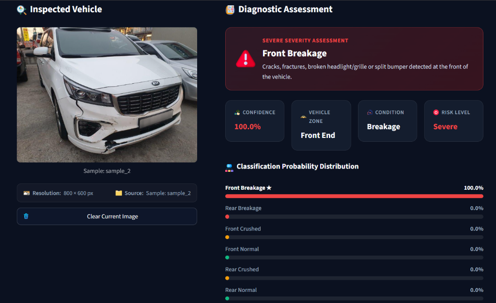

<div align="center">


# AutoDamage AI: Automated Vehicle Damage Inspector

[](https://www.python.org/)
[](https://pytorch.org/)
[](https://streamlit.io/)
[](https://optuna.org/)
[](https://www.flaticon.com/)
[](LICENSE)

<br/>

>  **Neural Vision Triage**  
> **Automated Vehicle Damage Inspector**  
> *Upload or capture a photo of a vehicle's front or rear section. The fine-tuned ResNet-50 neural network will classify the damage type, pinpoint the impact zone, and gauge severity in real-time.*

<br/>



</div>

---

## 📌 Table of Contents
- [ Overview](#-overview)
- [ Key Features](#-key-features)
- [ Target Classes & Damage Severity](#-target-classes--damage-severity)
- [ Model Architecture & Training](#-model-architecture--training)
- [ Project Structure](#-project-structure)
- [ Installation & Setup](#-installation--setup)
- [ Usage Guide](#-usage-guide)
- [ API Deployment (FastAPI)](#-api-deployment-fastapi)
- [ Tech Stack](#-tech-stack)
- [📄 License](#-license)

---

##  Overview

**AutoDamage AI** is an intelligent computer vision application built to streamline vehicle inspection, insurance triage, and collision damage severity estimation. By leveraging a fine-tuned **ResNet-50 convolutional neural network**, the system processes external photographs of automobiles to instantly determine:

1.  **Impact Location**: Front End vs. Rear End
2.  **Damage Condition**: Normal (Intact), Breakage (Cracks/Fractures), or Crushed (Structural Deformation)
3.  **Severity Assessment**: None, Moderate, or Severe risk ratings
4.  **Softmax Probability Distribution**: Calibrated confidence scores across all candidate classes

The application provides a sleek, modern dark-mode dashboard built with **Streamlit** alongside a high-performance **FastAPI** microservice for automated pipeline integration. All UI icons are powered by [Flaticon](https://www.flaticon.com/).

---

##  Key Features

- **Automotive Glassmorphic UI**: High-contrast, responsive dark dashboard styled with custom CSS (`#0b1120` slate navy, glowing status indicators, and clean typography).
-  **Direct File Uploader**: Drag and drop `.jpg`, `.jpeg`, `.png`, and `.webp` vehicle photos with automatic format validation.
-  **1-Click Quick Sample Gallery**: Built-in test cases for all 6 damage categories allowing immediate inspection without searching for crash photos.
- **Instant Diagnostic Assessment**:
  - **Dynamic Severity Banners**: Color-coded badges with dedicated status icons ( None,  Moderate,  Severe).
  - **4-KPI Metric Grid**: Highlights  **Confidence %**,  **Vehicle Zone**,  **Condition**, and  **Risk Level**.
  -  **Probability Distribution Breakdown**: Sorted percentage meters displaying full softmax output with top prediction highlighting.
-  **Smart Image Management**: One-click **"Clear Current Image"** button that resets both session states and the underlying file uploader cache cleanly.
-  **Quick Reset & Cache Flush**: Dedicated sidebar button to clear app state and reload.
-  **Photography Best Practices Guide**: Integrated sidebar checklist for optimal camera angles, lighting, and framing.
- **Hardware Acceleration**: Automatic runtime detection of NVIDIA GPU (`CUDA`) with seamless fallback to `CPU`.

---

##  Target Classes & Damage Severity

The model classifies vehicle photos into 6 distinct categories:

| Target Class | Impact Zone | Damage Condition | Severity Rating | Description |
|:---|:---:|:---:|:---:|:---|
| `F_Breakage` | **Front End** | Breakage / Crack |  **Severe** | Cracks, fractures, broken headlights/grille, or split bumper at the vehicle's front. |
| `F_Crushed` | **Front End** | Crushed / Deformation |  **Moderate** | Heavy frontal impact with hood crumple, bumper collapse, or radiator intrusion. |
| `F_Normal` | **Front End** | No Damage Detected |  **None** | Intact front panels, hood, bumper, and headlights with zero structural damage. |
| `R_Breakage` | **Rear End** | Breakage / Crack |  **Severe** | Cracked taillights, fractured bumper cover, or rear windshield/tailgate glass fracture. |
| `R_Crushed` | **Rear End** | Crushed / Deformation |  **Moderate** | Severe rear-end impact with trunk intrusion, bumper displacement, or quarter-panel damage. |
| `R_Normal` | **Rear End** | No Damage Detected |  **None** | Intact rear bumper, trunk lid, and taillights without visible structural deformation. |

---

##  Model Architecture & Training

The core classifier is built upon **ResNet-50**, a 50-layer deep residual network pretrained on ImageNet:

```
Input Image (224 × 224 × 3)
         │
         ▼
ResNet-50 Backbone (Layers 1-3 Frozen)
         │
         ▼
Fine-Tuned Layer 4 (Residual Blocks Unfrozen)
         │
         ▼
Adaptive Average Pooling
         │
         ▼
Dropout Layer (Rate: 0.44 - Optimized via Optuna)
         │
         ▼
Fully Connected Linear Layer (2048 ➔ 6 Classes)
         │
         ▼
Softmax Activation ➔ Class Probabilities
```

### Highlights:
- **Transfer Learning Strategy**: Initial convolution layers are kept frozen to leverage generic edge/texture representations, while `layer4` and the custom classification head are fine-tuned on vehicle damage features.
- **Optuna Hyperparameter Tuning**: Systematic Bayesian optimization was conducted (see [`Optuna_study.ipynb`](Optuna_study.ipynb)) to identify the optimal dropout rate (`0.44`) and learning rate schedules to mitigate overfitting.
- **Validation Accuracy**: Achieves **~78% classification accuracy** on test splits across varied angles, lighting environments, and automobile models.

---

##  Project Structure

```bash
Car_Damage_Detection_Project/
├── assets/
│   ├── app_demo.png                # Diagnostic assessment UI preview
│   └── icons/                      # Flaticon UI graphic assets
│       ├── car.png
│       ├── brain.png
│       ├── camera.png
│       ├── condition.png
│       ├── confidence.png
│       ├── folder.png
│       ├── gallery.png
│       ├── info.png
│       ├── inspection.png
│       ├── lightning.png
│       ├── moderate_alert.png
│       ├── normal_check.png
│       ├── report.png
│       ├── reset.png
│       ├── resolution.png
│       ├── risk.png
│       ├── severe_alert.png
│       ├── tag.png
│       ├── target.png
│       ├── trash.png
│       ├── upload.png
│       └── zone.png
├── fastapi-server/                 # REST API backend microservice
│   ├── model/
│   │   └── saved_model.pth         # PyTorch weights for API server
│   ├── model_helper.py             # Inference pipeline for FastAPI
│   ├── server.py                   # FastAPI application routes
│   └── requirements.txt            # API dependencies
├── streamlit-app/                  # Interactive Streamlit Web Application
│   ├── .streamlit/
│   │   └── config.toml             # Custom dark mode UI theme
│   ├── assets/
│   │   ├── app_demo.png            # App screenshot
│   │   └── icons/                  # Local Flaticon icon files
│   ├── model/
│   │   └── saved_model.pth         # Serialized model state dictionary
│   ├── notebooks/
│   │   ├── Damage_Detect.ipynb     # Model training, validation & evaluation notebook
│   │   └── Optuna_study.ipynb      # Hyperparameter optimization experiments 
│   ├── samples/                    # Pre-packaged demo images for 1-click testing
│   │   ├── front_breakage.jpg
│   │   ├── front_crushed.jpg
│   │   ├── front_normal.jpg
│   │   ├── rear_breakage.jpg
│   │   ├── rear_crushed.jpg
│   │   └── rear_normal.jpg
│   ├── app.py                      # Main Streamlit dashboard application
│   ├── model_helper.py             # Model definition, transformations & detailed predictions
│   └── requirements.txt            # Streamlit app dependencies           
└── README.md                       # Master project documentation
```

---

##  Installation & Setup

### 1. Prerequisites
- **Python**: Version `3.10` or higher
- **GPU (Optional, Recommended)**: NVIDIA GPU with CUDA drivers installed for hardware-accelerated inference

### 2. Clone the Repository
```bash
git clone https://github.com/<your-username>/Car_Damage_Detection_Project.git
cd Car_Damage_Detection_Project
```

### 3. Create and Activate Virtual Environment
```bash
# Windows (PowerShell)
python -m venv .venv
.\.venv\Scripts\Activate.ps1

# Linux / macOS
python3 -m venv .venv
source .venv/bin/activate
```

### 4. Install Dependencies
```bash
cd streamlit-app
pip install -r requirements.txt
```

---

##  Usage Guide

### Launching the Streamlit Web Application

From within the `streamlit-app` directory:
```bash
streamlit run app.py
```

Once started, open your web browser and navigate to:
```
http://localhost:8501
```

### How to Inspect a Vehicle:
1. **Upload an Image**: Go to the **Upload Image** tab and upload a JPG, JPEG, or PNG photo of the vehicle's front or rear.
2. **Or Test with Samples**: Go to the **Quick Sample Gallery** tab and click any thumbnail to test instantly.
3. **View AI Diagnostics**:
   - Inspect the **Severity Banner** and **4-KPI Grid** for primary findings.
   - Review the **Probability Distribution** to observe confidence spread across classes.
4. **Clear or Switch**: Click **Clear Current Image** to reset the inspector or upload a new photo.

---

##  API Deployment (FastAPI)

For headless or service-to-service deployments, a lightweight FastAPI microservice is included:

```bash
cd fastapi-server
pip install -r requirements.txt
fastapi dev server.py
```

- **Interactive API Docs (Swagger UI)**: `http://localhost:8000/docs`
- **Inference Endpoint**: `POST /predict/` accepts multipart image file uploads and returns predicted damage class and diagnostic payloads.

---

##  Tech Stack

- **Computer Vision & Deep Learning**: [PyTorch](https://pytorch.org/), [Torchvision](https://pytorch.org/vision/), [Pillow](https://pillow.readthedocs.io/)
- **Hyperparameter Optimization**: [Optuna](https://optuna.org/)
- **Frontend / Dashboard**: [Streamlit](https://streamlit.io/) with custom modern CSS & HTML5
- **Icons & Graphics**: [Flaticon](https://www.flaticon.com/)
- **Backend API**: [FastAPI](https://fastapi.tiangolo.com/), [Uvicorn](https://www.uvicorn.org/)
- **Data & Scientific Computing**: [NumPy](https://numpy.org/), [scikit-learn](https://scikit-learn.org/)

---

## 📄 License

This project is licensed under the [MIT License](LICENSE). You are free to use, modify, and distribute it for academic, personal, and commercial applications.
